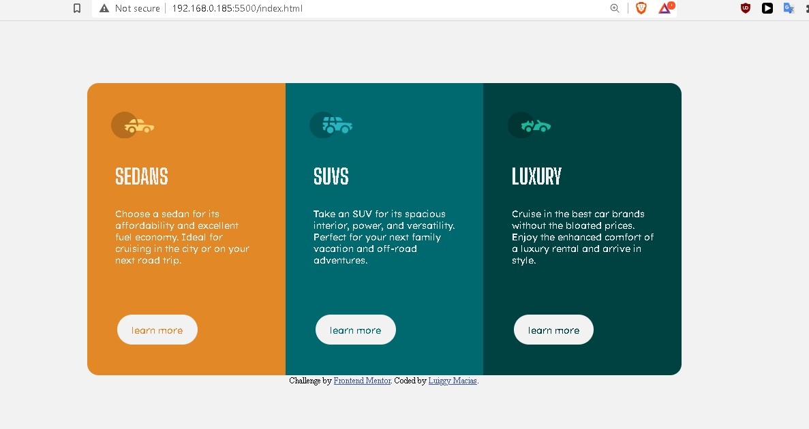

# Frontend Mentor - 3-column preview card component solution

This is a solution to the [3-column preview card component challenge on Frontend Mentor](https://www.frontendmentor.io/challenges/3column-preview-card-component-pH92eAR2-). Frontend Mentor challenges help you improve your coding skills by building realistic projects. 

## Table of contents

- [Overview](#overview)
  - [The challenge](#the-challenge)
  - [Screenshot](#screenshot)
  - [Links](#links)
- [My process](#my-process)
  - [Built with](#built-with)
  - [What I learned](#what-i-learned)
  - [Continued development](#continued-development)
  - [Useful resources](#useful-resources)
- [Author](#author)


## Overview

### The challenge

Users should be able to:

- View the optimal layout depending on their device's screen size
- See hover states for interactive elements

### Screenshot




### Links

- Solution URL: [GitHub repository](https://github.com/macluiggy/3-column-preview-card-component-main)
- Live Site URL: [GitHub page](https://macluiggy.github.io/3-column-preview-card-component-main)

## My process

### Built with

- Semantic HTML5 markup
- CSS custom properties
- CSS Grid
- Mobile-first workflow

### What I learned

i made this project because i wanted to practice css grid techniques and solidify its concepts, using the repeat() with auto-fit and madmix as its parameters, this way the grids become flexible and it wraps when convenient, this make a responsive layout. The css code to make this possible is this:

```css
main {
    border-radius: 1em;
    overflow: hidden;
    width: 65%;
    margin: 0 auto;
    display: grid;
    grid-template-columns: repeat(auto-fit, minmax(15em,1fr));

```


### Continued development

This is the first project I used CSS techniques, so I'll continue implement this techniques in futures projects, because it's and eficcient way to make a responsive page and to arrange the content of a page too.

### Useful resources

- [CSS grid repository](https://github.com/macluiggy/freeCodeCamp-concepts-practice/blob/main/css-grid.html) - This repository its the first practice i used to learn to use css grid, this was taken from freeCodeCamp


## Author

- LInkedIn - [Luiggy Macias](https://www.linkedin.com/in/luiggy-macias-402696155/)
- Frontend Mentor - [@macluiggy](https://www.frontendmentor.io/profile/macluiggy)
